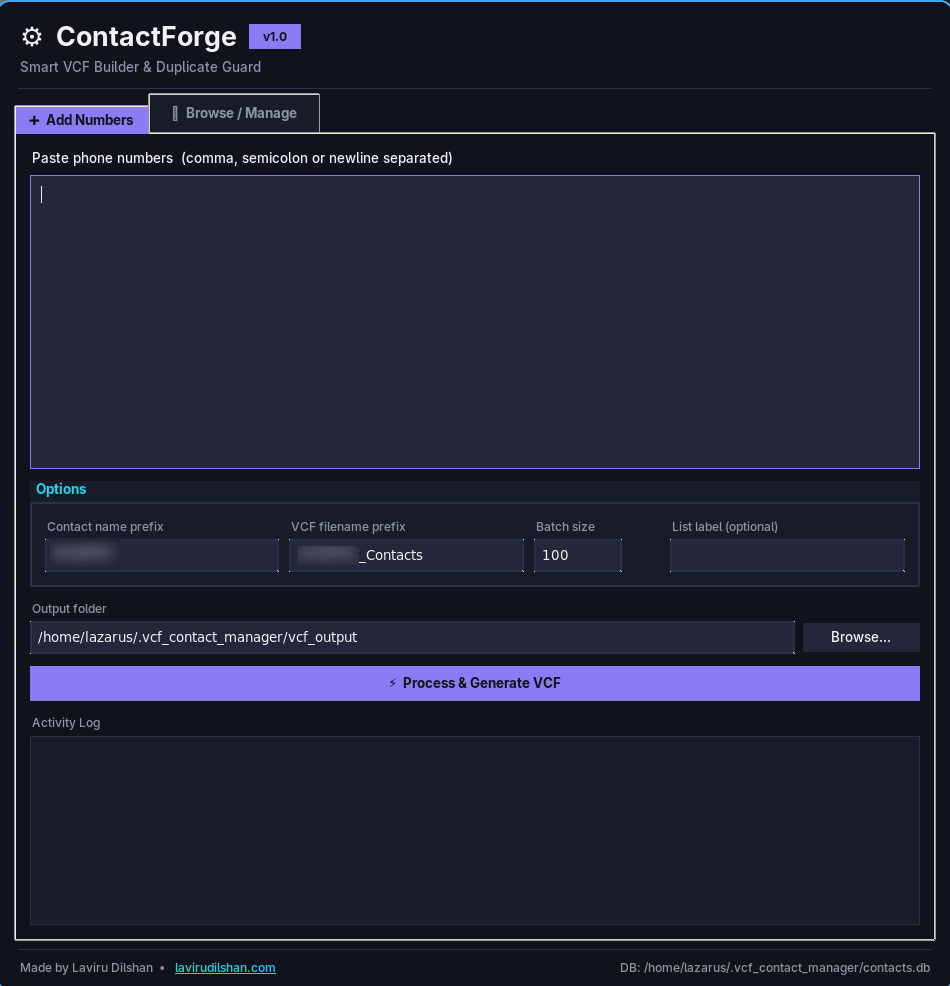
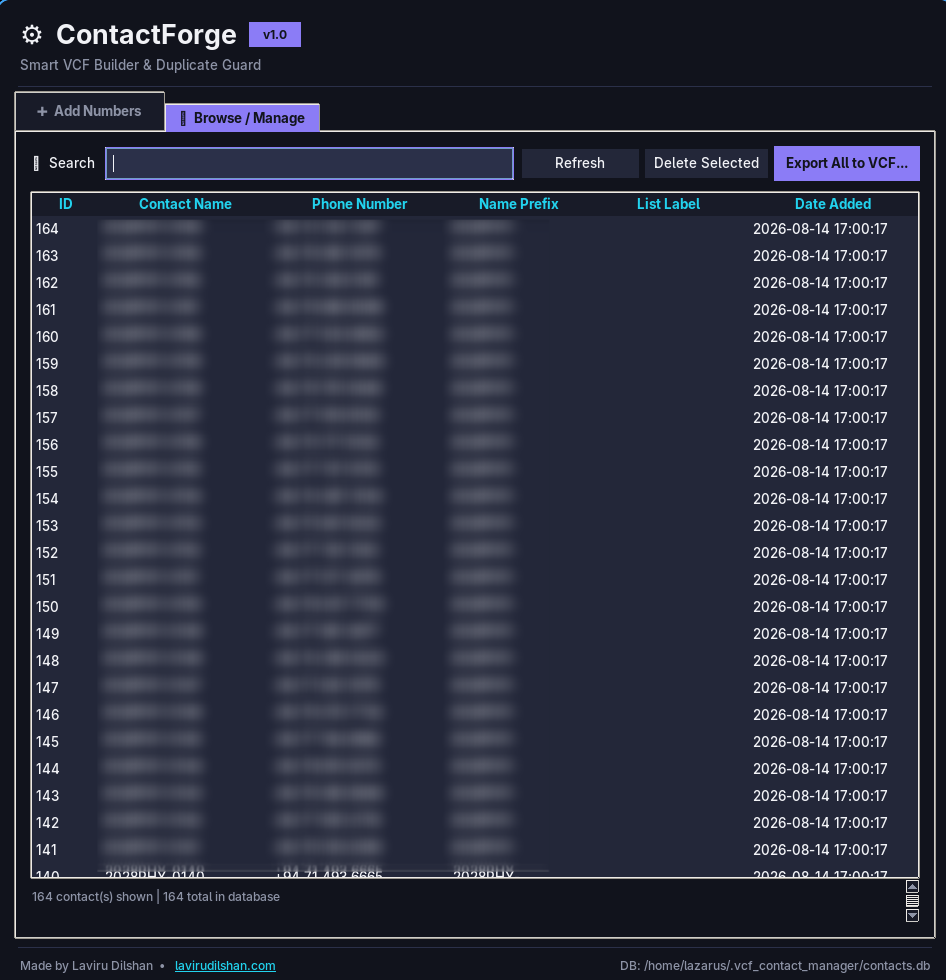

<div align="center">

# ⚙️ ContactForge

**Smart VCF Builder & Duplicate Guard**

Turn pasted phone number lists into clean, batched `.vcf` contact files —
with a local SQLite-backed duplicate guard so the same number never becomes
a duplicate contact twice, even across completely different lists.


</div>

---

## Overview

ContactForge is a lightweight desktop utility for anyone who regularly
converts large, messy phone number lists into `.vcf` contact files —
bulk SMS campaigns, outreach lists, imported CSV exports, and similar
bulk-contact workflows.

Paste a list, get named, de-duplicated contacts split into clean batch files.
Paste an overlapping list next week, and numbers you've already converted are
automatically skipped instead of becoming duplicate contacts.

No external dependencies, no cloud account, no install steps beyond having
Python — everything runs 100% locally.

## Features

- **Paste-and-go input** — accepts numbers separated by commas, semicolons,
  or newlines, in any mix
- **Persistent duplicate guard** — every number is checked against a local
  SQLite database before it's turned into a contact, so re-pasting an
  overlapping list never creates duplicate entries
- **Format-tolerant matching** — numbers with different spacing or
  separators (e.g. `+XX XX XXX XXXX` vs `+XXXXXXXXXXX`) are recognized as
  the same number when checking for duplicates
- **Continuous numbering** — new contacts continue numbering from wherever
  the last batch left off for that prefix, instead of resetting to `0001`
- **Batched `.vcf` output** — automatically splits large lists into multiple
  files at a configurable batch size (default 100 contacts per file)
- **Customizable prefixes** — set your own contact-name prefix and VCF
  filename prefix per run, remembered between sessions
- **Browse & manage** — view every stored contact, search/filter, delete
  entries, and re-export the full database (or a filtered view) to `.vcf`
  at any time
- **Modern dark UI** — clean, distraction-free interface built with Tkinter
- **Fully offline** — no network access, no telemetry, no account required

## Screenshots

<div align="center">

| Add Numbers | Browse / Manage |
|:---:|:---:|
|  |  |

</div>

## Requirements

- Python **3.8+**
- `tkinter` and `sqlite3` — both ship with the Python standard library, so
  **no third-party packages are required** to run this tool
  - On most Linux distros, if `tkinter` isn't already present:
    `sudo apt install python3-tk` (Debian/Ubuntu) or the equivalent for
    your distro
  - On Windows and macOS, the official Python installer from
    [python.org](https://www.python.org/downloads/) includes Tkinter by
    default

A `requirements.txt` is included for convention/completeness — it's empty
because there's nothing to install, but running it costs nothing either:

```bash
pip install -r requirements.txt
```

## Installation

```bash
git https://github.com/LaviruDilshan/contact-forge.git
cd contactforge
pip install -r requirements.txt
python vcf_contact_manager.py
```

No virtual environment is strictly necessary since there are no
dependencies, but feel free to use one if that's your usual workflow.

## Usage

1. **Add Numbers tab**
   - Paste your phone numbers into the text box (commas, semicolons, or
     newlines all work, mixed freely)
   - Set your **contact name prefix** and **VCF filename prefix**
   - Optionally set a **batch size** and a **list label** (useful for
     tracking which import a number came from)
   - Click **Process & Generate VCF**
   - New, non-duplicate numbers are saved to the database and written out
     as batched `.vcf` files in your chosen output folder

2. **Browse / Manage tab**
   - View every contact ever stored, with name, number, prefix, list
     label, and date added
   - Search/filter by name, number, or list label
   - Delete entries you no longer want tracked as duplicates
   - Export the full database (or your current filtered view) back out to
     fresh `.vcf` files at any time

## How duplicate detection works

Each number is reduced to a digits-only key for comparison (stripping `+`,
spaces, dashes, and parentheses), so common formatting differences are
tolerated. That key is checked against the local database before any
contact is created:

- **Already exists** → skipped, no duplicate created
- **New** → added to the database and written to the next `.vcf` batch

> **Note:** this does *not* reconcile local vs. international formats —
> e.g. a locally formatted number and its full international-format
> equivalent (say `0XXXXXXXXX` vs `+94XXXXXXXXX`) will be treated as two
> different numbers. Keep one format consistent across your lists for
> clean deduplication.

## Data storage

| What | Where |
|---|---|
| SQLite database | `~/.vcf_contact_manager/contacts.db` |
| Default `.vcf` output folder | `~/.vcf_contact_manager/vcf_output/` |

On Windows, `~` resolves to `C:\Users\<you>\`. The output folder can be
changed at any time from the **Add Numbers** tab. The database is a plain
SQLite file — back it up to preserve your duplicate-detection history, or
open it directly in any SQLite browser if you want to inspect the raw
data.

## Project structure

```
contactforge/
├── vcf_contact_manager.py   # the entire application (GUI + DB + VCF logic)
├── requirements.txt         # no external deps — included for convention
├── screenshots/             # optional, for the README preview images
└── README.md
```

## Roadmap

Ideas for future versions:

- [ ] CSV import/export
- [ ] Editable per-contact fields beyond name/number (email, organization)
- [ ] Multiple named number lists managed within a single database
- [ ] Optional shared/team database backend
- [ ] Packaged standalone executables (PyInstaller builds for Windows/macOS)

## Contributing

Issues and pull requests are welcome. If you run into a bug or have a
feature idea, feel free to open an issue.

## Author

**Laviru Dilshan**
🌐 [lavirudilshan.com](https://lavirudilshan.com)

---

<div align="center">
Made with ⚙️ by Laviru Dilshan
</div>